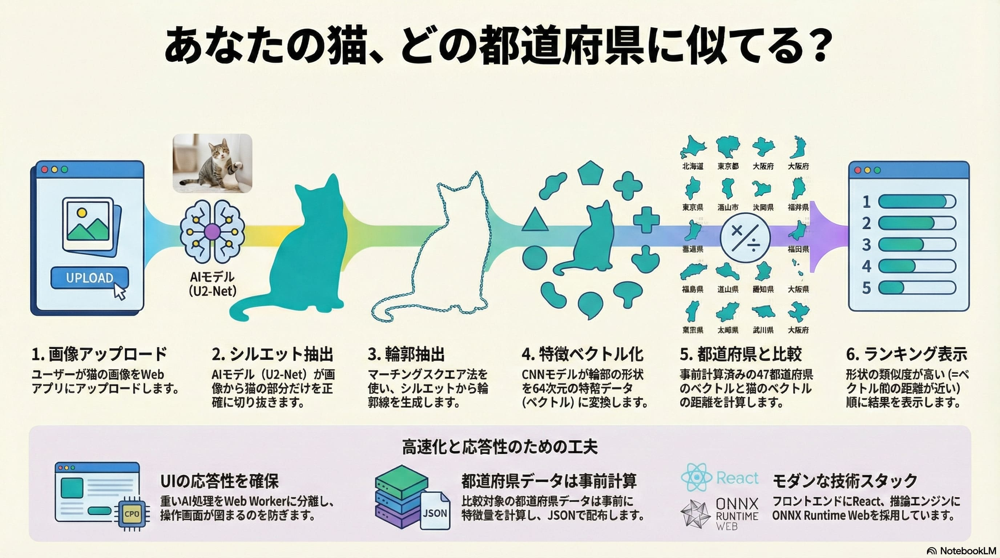

# Cat Contour Similarity Tool



猫の画像から輪郭を抽出し、形状が似ている日本の都道府県を探すWebアプリケーションです。
画像処理と推論はすべてブラウザ上（クライアントサイド）で実行されるため、画像データが外部サーバーに送信されることはありません。

## Features

- **Client-side Processing**: 画像処理・推論はすべてブラウザ内で完結
- **Segmentation**: U2-Netモデルによる猫の領域抽出
- **Shape Matching**: CNN埋め込みベースの形状類似度計算（補助特徴量としてHuモーメント、楕円フーリエ記述子等も使用）

## Usage

1. 猫の画像をアップロード（ドラッグ&ドロップ可）
2. 自動的に輪郭が抽出されます
3. 形状が似ている都道府県が表示されます

> **Note**: 背景がシンプルで、猫の全身が写っている写真を使用すると精度が向上します。

## Development

### Prerequisites

- Node.js 20.19+ (or 22.12+)
- npm or yarn

### Setup

```bash
# 依存関係のインストール
npm install

# サブモジュールの初期化 (都道府県境界のGeoJSON)
git submodule update --init --recursive

# 都道府県特徴量の事前計算 (`public/assets/pref_features.json` に書き込み)
npm run build:pref

# 開発サーバーの起動
npm run dev
```

### CI/CD

GitHub Actionsで自動テスト・ビルドを実行しています。

- **CI**: main ブランチへのプッシュ・PR時に自動実行
  - ユニットテスト (Vitest)
  - E2Eテスト (Playwright): モックテスト全ブラウザ + 実推論テスト (Chromium)
  - ビルド確認
- **Deploy**: 手動実行 (workflow_dispatch)
  - CI実行後、テストが通った場合のみ GitHub Pages へデプロイ

### Deploy

このリポジトリは、GitHub Pages のプロジェクトサイトとして `/cat-contour-similarity-tool/` 配下にデプロイされるように設定されています。
`public/assets/` 配下の静的アセット（モデル + 事前計算された特徴量）は実行時に必要であり、リポジトリで管理されています。

### Documents

- [AGENTS.md](AGENTS.md) - AIコーディングエージェント向けのガイドライン
- [ARCHITECTURE.md](src/ARCHITECTURE.md) - アーキテクチャ設計方針とディレクトリ構造

## Credits

- **Model Weights**: [Kazuhito00/U-2-Net-ONNX-Sample](https://github.com/Kazuhito00/U-2-Net-ONNX-Sample) (u2netp.onnx)
  - Original model: [xuebinqin/U-2-Net](https://github.com/xuebinqin/U-2-Net)
- **Prefecture GeoJSON**: [dataofjapan/land](https://github.com/dataofjapan/land)
  - 出典元: [地球地図日本(国土地理院)](https://www.gsi.go.jp/kankyochiri/gm_jpn.html)
- **ONNX Runtime Web**: Microsoft

## License

MIT

This license applies to the source code in this repository.
For third-party assets (model weights, prefecture data), see below.

## Third-Party Notices

This project includes third-party assets under `public/assets/` (e.g. the ONNX model and precomputed prefecture features).
Those assets may be under different licenses/terms than the MIT license for the source code.
See [THIRD_PARTY_NOTICES.md](THIRD_PARTY_NOTICES.md) for details.
