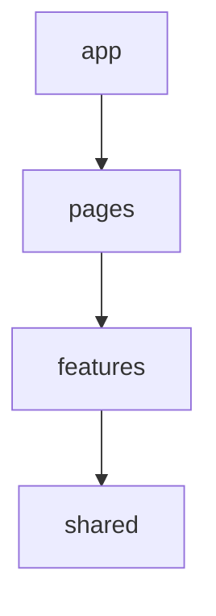

# 🏗️ アーキテクチャガイド

このプロジェクトのアーキテクチャ設計方針、ディレクトリ構造、および開発ルールについて記述します。

## 🎯 1. 設計の目的

このアーキテクチャは以下の3点を達成するために設計されています。

1.  **依存の向きの制御**: 上位レイヤから下位レイヤへの一方向依存を強制する。
2.  **配置ルールの明確化**: コードをどこに置くべきか迷わせない。
3.  **カプセル化**: Barrel export (`index.ts`) を用いて公開APIを制御する。

---

## 📂 2. レイヤ構造と責務

### ディレクトリ構成

```text
src/
  ├── app/           # アプリ初期化・ルーティング定義
  ├── pages/         # Route-level の画面コンポーネント
  ├── features/      # ユーザー操作単位の機能 (Domain Logic)
  └── shared/        # ドメインを知らない汎用モジュール
```

### 依存の方向 (Dependency Rule)

上位から下位への参照のみを許可します。



### 各レイヤの責務詳細

| レイヤ       | 役割・責務                                | 設計原則                    |
| :----------- | :---------------------------------------- | :-------------------------- |
| **app**      | エントリーポイント、Providers、ルート定義 | **ロジックを持たない**      |
| **pages**    | Route単位の画面組み立て                   | **features を配置するだけ** |
| **features** | 機能単位のUI・Hooks・ロジック             | **ドメイン知識を持つ**      |
| **shared**   | UIコンポーネント、ユーティリティ          | **ドメイン知識を持たない**  |

> **Note**: `entities/` ディレクトリは、型やロジックが複数の `features` で共有される必要が生じた場合にのみ作成します（YAGNI原則）。

---

## 📦 3. 公開API (Barrel Export)

各モジュールの境界を明確にするため、`index.ts` を通じて外部に公開するものを制御します。

### 配置場所

- `features/*/index.ts`
- `pages/*/index.ts`
- `shared/ui/index.ts`

### ルール

- ✅ **許可**: 他レイヤから利用するコンポーネントや関数のみを export する。
- 🚫 **禁止**: 同一レイヤ内部での import 時に、自分の `index.ts` を経由すること（循環参照防止）。

---

## 🛣️ 4. ルーティングとページ構成

### 責務分担

- **`app/routes`**: ルーティング定義のみを行う。
- **`pages/*`**: 画面レイアウトを担当。状態管理や複雑なロジックは `features/*/hooks` に委譲する。

### 新規ページ追加フロー

1. `src/pages/{page-name}/` ディレクトリを作成。
2. `{PageName}.tsx` と `index.ts` を作成。
3. `app/routes/index.tsx` にルート定義を追加。

---

## 🖼️ 5. アセット管理

### Public ディレクトリ (`public/`)

静的ファイルはここに配置します。

- 推論モデル: `assets/models/*.onnx`
- 事前計算データ: `assets/pref_features.json`

### パス解決

GitHub Pages 等のサブパス配信に対応するため、必ずヘルパー関数を経由してパスを解決してください。

```typescript
import { publicAssetUrl } from '@/features/cat-matching/lib/assets';

// ❌ NG: 直接パスを指定
// const url = '/assets/models/u2netp.onnx';

// ⭕ OK: ヘルパー関数を使用
const url = publicAssetUrl('assets/models/u2netp.onnx');
```

---

## 🛠️ 6. 開発・テスト・デプロイ

### テスト戦略

| テスト種類             | ツール     | 対象ファイル       |
| :--------------------- | :--------- | :----------------- |
| **Unit / Integration** | Vitest     | `src/**/*.test.ts` |
| **E2E**                | Playwright | `tests/e2e/`       |

### デプロイ設定

GitHub Pages でのサブパス配信を前提としています。
`vite.config.ts` の `base` 設定が必須です。
